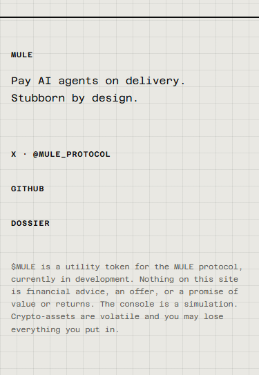
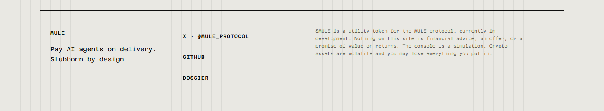

# Pages légales cachées — partie A

Vérifications du **7 octobre 2026**. [PR #3](https://github.com/Mule-Protocol/mule-site/pull/3), branche `codex/legal-hidden` depuis `main` à jour. **PR en brouillon ; aucune fusion, aucun déploiement de production, aucune action DNS ou domaine dans cette tâche. La partie B attend la confirmation de fusion par le propriétaire.**

## Commits, CI et préproduction

- Base `main` : [`5038e02916d5cf844150c4403462fab18ca45520`](https://github.com/Mule-Protocol/mule-site/commit/5038e02916d5cf844150c4403462fab18ca45520), fusion de la deuxième passe (PR #2).
- Code testé : [`e74cd74d92e5005fc9f3f3a982057bef02188eca`](https://github.com/Mule-Protocol/mule-site/commit/e74cd74d92e5005fc9f3f3a982057bef02188eca), `fix: hide draft legal pages on the public domain`.
- Rapport et preuves : commit documentaire suivant, `docs: record legal hiding verification and preview evidence`, sur la [même branche](https://github.com/Mule-Protocol/mule-site/commits/codex/legal-hidden). Il ne modifie pas le site exécuté.
- [CI de déploiement 37651583468](https://github.com/Mule-Protocol/mule-site/actions/runs/37651583468) : **Validate et Deploy Pages réussis**, commit de code ci-dessus, événement `push` sur `codex/legal-hidden`.
- [CI de PR 37651591744](https://github.com/Mule-Protocol/mule-site/actions/runs/37651591744) : **réussie**. [État et jobs en JSON](legal-hidden/ci.json).
- **Préproduction immuable vérifiée : [https://a79063ac.mule-site.pages.dev/](https://a79063ac.mule-site.pages.dev/)**. [Preuve du déploiement](legal-hidden/deployment.json) : environnement `preview`, commit `e74cd74…`, statut `success`.

## Comportement livré

`LEGAL_PUBLISHED: false` porte exactement le commentaire demandé. Le footer omet les liens Legal notice, Privacy et Risks ; X, GitHub, Dossier et l'intégralité de l'avertissement existant sont conservés.

| Hôte et réglage | Résultat sur les six chemins |
| --- | --- |
| `muleprotocol.com`, `false` | 404, contenu du fichier 404 existant, `X-Robots-Tag: noindex, nofollow`, `Cache-Control: no-store`, en-têtes de sécurité habituels |
| `www.muleprotocol.com`, `false` | 301 vers le domaine principal, chemin et paramètres conservés, puis même 404 |
| `*.pages.dev`, `false` ou `true` | Accès aux documents conservé, 200 avec `noindex` sur leurs URL canoniques |
| `muleprotocol.com`, `true` | Accès rétabli, 200 avec `noindex` maintenu |
| `www.muleprotocol.com`, `true` | 301 vers le domaine principal, puis accès rétabli avec `noindex` |

Chemins testés : `/legal`, `/legal/`, `/privacy`, `/privacy/`, `/risks`, `/risks/`. La 301 de `www` est volontairement prioritaire : elle ne devient pas une 404 directe.

Le middleware charge l'asset compilé `404.html` via son URL canonique `/404`, avec une requête GET neuve sans en-têtes conditionnels ni corps entrant. La politique impose ensuite le statut 404 et `no-store`. Cela évite une seconde copie du texte ou du rendu 404. Référence : [API Pages, `env.ASSETS.fetch()`](https://developers.cloudflare.com/pages/functions/api-reference/#envassetsfetch), qui demande le chemin canonique de l'asset.

## Vérifications

- **31 tests unitaires réussis**, dont les six chemins, GET/HEAD/POST, la chaîne `www` → apex, trois hôtes Pages, le réglage `true`, les en-têtes, la récupération du vrai endpoint d'asset 404 et le rendu réel du composant Astro Footer dans les deux états. [Sortie complète](legal-hidden/tests.txt).
- **Build de préproduction réussi**, zéro erreur, avertissement ou hint ; métadonnées `noindex, nofollow`. [Sortie](legal-hidden/build-preview.txt).
- **Build de production effectué uniquement localement**, zéro erreur, avertissement ou hint ; accueil et dossier `index, follow`, `robots.txt` permissif. Ce contrôle ne déploie rien. [Sortie](legal-hidden/build-production.txt).
- **32 contrôles HTTP dans Wrangler Pages local 4.148.0** : les six chemins sur apex et `www`, GET et HEAD (24 cas), les trois documents canoniques sur deux hôtes Pages (6 cas), accueil et dossier sur apex (2 cas). Toutes les assertions passent. [Réponses et en-têtes](legal-hidden/local-runtime.json).
- Pour chaque GET caché, égalité exacte avec `dist/404.html`. SHA-256 du fichier comparé : `8e8558c01e5745878aade5de3015b1d4c85de9f8935a0e0a783e003ea14cc193`. HEAD renvoie un corps vide.
- **HTML construit et servi de `/` et `/dossier/` sans lien vers les trois routes**, contrôlé au build et dans le navigateur sur la préproduction. Le sitemap contient exactement `https://muleprotocol.com/` et `https://muleprotocol.com/dossier/` ; cette assertion est désormais exécutée à chaque build.
- Recherche des occurrences dans `src`, `functions`, `public` : [sortie](legal-hidden/source-search.txt). Recherche supplémentaire des trois chemins dans les fichiers suivis hors documentation : [sortie](legal-hidden/link-search.txt). Le seul composant qui propose ces liens est le footer, désormais conditionnel. Les occurrences des tests et scripts de QA ne sont pas des liens livrés. Les ancres internes `#legal` et `#risks` du dossier restent intactes : elles visent des sections de ce document.
- **Quatre captures Chromium**, accueil et dossier à 375 et 1440 px, polices chargées, mouvements réduits. Aucun débordement, aucune erreur JavaScript, trois liens attendus et texte intégral de l'avertissement vérifiés. [Résultats](legal-hidden/browser.json). Inspection visuelle des captures : footer lisible, avertissement non tronqué.

Les réponses des domaines personnalisés sont vérifiées **unitairement et dans le runtime local avec les en-têtes Host correspondants**. Leur activation et les vérifications HTTPS sur les vrais domaines relèvent de la partie B, non commencée. La préproduction HTTPS ci-dessous a bien été interrogée en ligne.

## `curl -I` sur la préproduction immuable

Commande exécutée avec `curl.exe` sous Windows :

```sh
curl -I https://a79063ac.mule-site.pages.dev/legal/
```

Sortie brute, également disponible [dans ce fichier](legal-hidden/preview-legal-headers.txt) :

```text
HTTP/1.1 200 OK
Date: Wed, 07 Oct 2026 16:25:20 GMT
Content-Type: text/html; charset=utf-8
Connection: keep-alive
Cache-Control: public, max-age=0, must-revalidate
ETag: "6f1a6f5efcde828bc5f6c6bd3342f054"
Strict-Transport-Security: max-age=31536000; includeSubDomains
content-security-policy: default-src 'self'; script-src 'self' https://static.cloudflareinsights.com; style-src 'self'; font-src 'self'; img-src 'self'; connect-src 'self' https://cloudflareinsights.com; object-src 'none'; base-uri 'self'; frame-ancestors 'none'; form-action 'self'; upgrade-insecure-requests
permissions-policy: camera=(), microphone=(), geolocation=(), payment=()
referrer-policy: strict-origin-when-cross-origin
x-content-type-options: nosniff
x-frame-options: DENY
x-robots-tag: noindex, nofollow
Report-To: {"group":"cf-nel","max_age":604800,"endpoints":[{"url":"https://a.nel.cloudflare.com/report/v4?s=cYFViSdr9kB%2FPkYXaBuf%2BtdKijJCFxfPpmlOpDBqjOh0FOI8laLt%2BR6tj3949PUs96uUaAivovFjXmBAsXzK51BsgS8bLUk2s6iHPf7JuZxE821Tc2N5I3YUETAnDVCZhvTNeBPIyrZq7Oql2smbOVrlarrgnBpcujVe"}]}
Nel: {"report_to":"cf-nel","success_fraction":0.0,"max_age":604800}
Server: cloudflare
CF-RAY: a46e42de7ea502de-CDG
alt-svc: h3=":443"; ma=86400
```

## Captures du footer

| Page | 375 px | 1440 px |
| --- | --- | --- |
| Accueil | [PNG](legal-hidden/footer-home-375.png) | [PNG](legal-hidden/footer-home-1440.png) |
| Dossier | [PNG](legal-hidden/footer-dossier-375.png) | [PNG](legal-hidden/footer-dossier-1440.png) |





## Périmètre préservé et suite

`LAUNCHED=false`, `CONTRACT_ADDRESS=null` ; CSP inchangée, sans `unsafe-inline`. Aucun contenu juridique ni autre texte du site modifié. Aucun changement aux styles, aux pages, au contenu du dossier, aux dépendances, au workflow ou aux réglages Cloudflare. Aucun wallet, analytics ou post X ajouté. Le travail de mascotte déjà présent dans le checkout principal est resté hors de cette branche.

Le propriétaire peut relire la PR et les captures, puis fusionner lui-même. **Attendre sa confirmation avant toute étape de la partie B.** Le rapport de domaine et la branche `codex/domain` ne sont pas créés à ce stade.


## Correction après review — variantes de chemins légaux

Correction du **7 octobre 2026**, sur la même PR #3, toujours en brouillon. Le filtre initial était trop strict : les variantes telles que `/legal//` n'étaient pas reconnues. La seule ligne de code du site modifiée remplace ce filtre par `^\/(legal|privacy|risks)(\/.*)?$`. La variable `legalPath` reste utilisée à la fois pour le masquage et pour `X-Robots-Tag` ; aucun autre comportement ni texte du site n'est modifié.

- Commit correctif : [`94cf59ba4426a5d3a8a86b742e3e81ef35390246`](https://github.com/Mule-Protocol/mule-site/commit/94cf59ba4426a5d3a8a86b742e3e81ef35390246), `fix: cover legal draft path variants`.
- [CI et déploiement de préproduction 37653971386](https://github.com/Mule-Protocol/mule-site/actions/runs/37653971386) : **réussis** sur ce commit. [CI de PR 37653979308](https://github.com/Mule-Protocol/mule-site/actions/runs/37653979308) : **réussie**.
- **Nouvelle préproduction immuable vérifiée : [https://b6d59114.mule-site.pages.dev/](https://b6d59114.mule-site.pages.dev/)**. Déploiement GitHub `6915526344`, environnement `preview`, statut `success`, associé au commit correctif. Les URL et résultats précédents documentent la version avant cette correction.
- **36 tests réussis**, build de préproduction réussi. Les cinq nouveaux cas vérifient GET et HEAD sur le domaine principal avec `LEGAL_PUBLISHED: false` : `/legal//`, `/legal/x`, `/privacy//`, `/risks/index.html`, `/legal/?a=1` donnent 404, `noindex, nofollow`, `no-store`, les en-têtes de sécurité et le contenu 404 attendu (corps vide pour HEAD). Le contrôle des routes voisines couvre désormais `/legalese` : il passe à la réponse suivante sans interception ni ajout de `noindex`.
- Vérification de régression : avant modification du filtre, quatre nouveaux cas échouaient ; celui avec le paramètre `?a=1` passait déjà. Après correction, toute la suite passe.

Commande exécutée avec `curl.exe` sous Windows, sur cette nouvelle préproduction :

```sh
curl -I https://b6d59114.mule-site.pages.dev/legal//
```

Sortie brute :

```text
HTTP/1.1 200 OK
Date: Wed, 07 Oct 2026 16:43:06 GMT
Content-Type: text/html; charset=utf-8
Connection: keep-alive
Cache-Control: public, max-age=0, must-revalidate
ETag: "6f1a6f5efcde828bc5f6c6bd3342f054"
Strict-Transport-Security: max-age=31536000; includeSubDomains
content-security-policy: default-src 'self'; script-src 'self' https://static.cloudflareinsights.com; style-src 'self'; font-src 'self'; img-src 'self'; connect-src 'self' https://cloudflareinsights.com; object-src 'none'; base-uri 'self'; frame-ancestors 'none'; form-action 'self'; upgrade-insecure-requests
permissions-policy: camera=(), microphone=(), geolocation=(), payment=()
referrer-policy: strict-origin-when-cross-origin
x-content-type-options: nosniff
x-frame-options: DENY
x-robots-tag: noindex, nofollow
Report-To: {"group":"cf-nel","max_age":604800,"endpoints":[{"url":"https://a.nel.cloudflare.com/report/v4?s=8O5P7m0ZQE4Z38cg2uR47zv2LpF%2FaEaw79b2ium6%2FPZU1%2BnCvau3zVQWafBLvmxEuaN8wDT3s7mK75ssrQhxTllX9z%2Bt%2FSNb%2FpNzulSZ%2B1jSlJoohUQaW6XZnep%2BKhqXJseMux7wCjb5U6BK6obJHdN9j1iECOsPMC4f"}]}
Nel: {"report_to":"cf-nel","success_fraction":0.0,"max_age":604800}
Server: cloudflare
CF-RAY: a46e5ce5fa5fbb2d-CDG
alt-svc: h3=":443"; ma=86400
```

**Résultat : 200 avec `X-Robots-Tag: noindex, nofollow`**, conforme à l'accès de relecture conservé sur Pages. Les tests sur le domaine principal restent des tests unitaires ; aucune activation du domaine n'est effectuée ici. La PR n'est pas fusionnée, aucune production n'est déployée et la partie B attend toujours la confirmation de fusion par le propriétaire.
