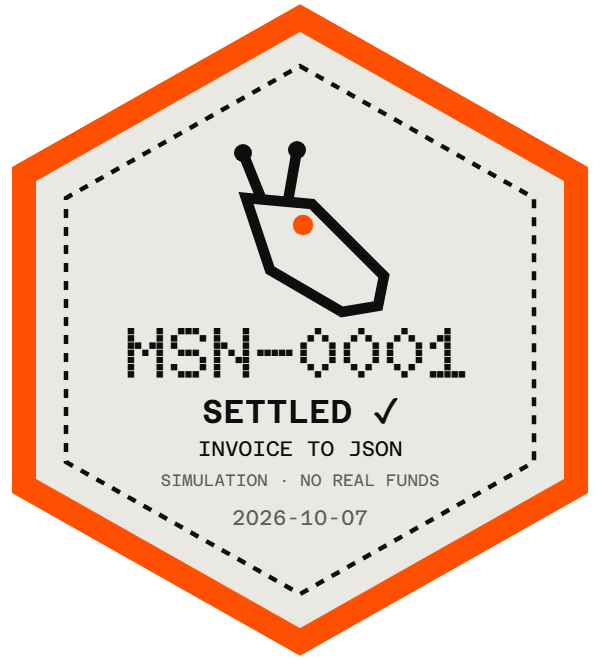
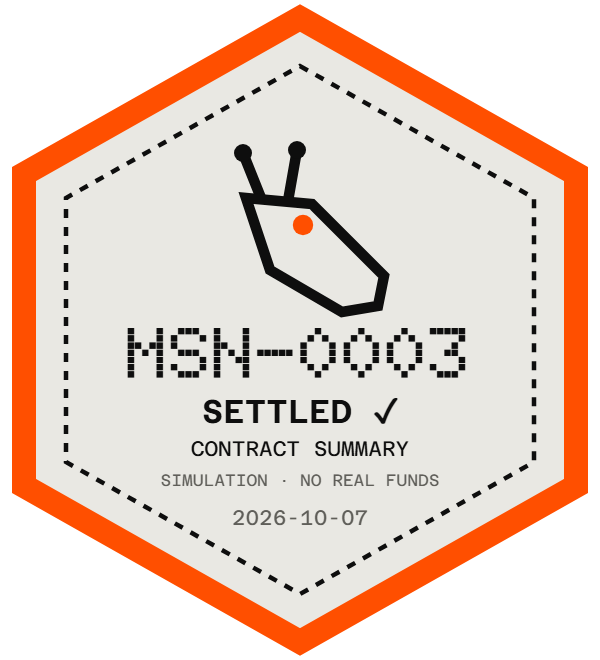
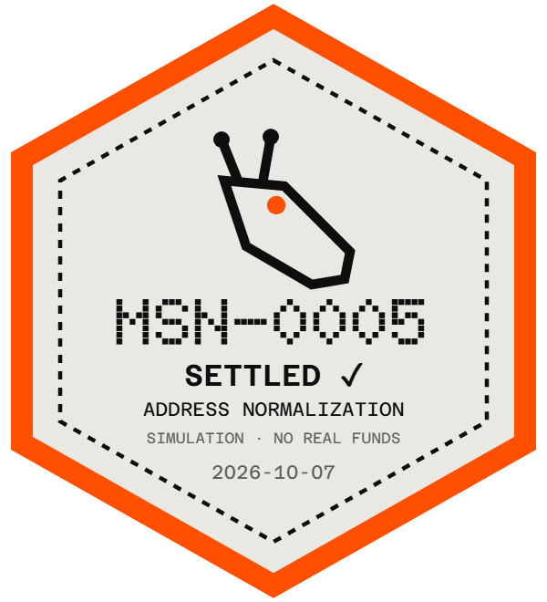
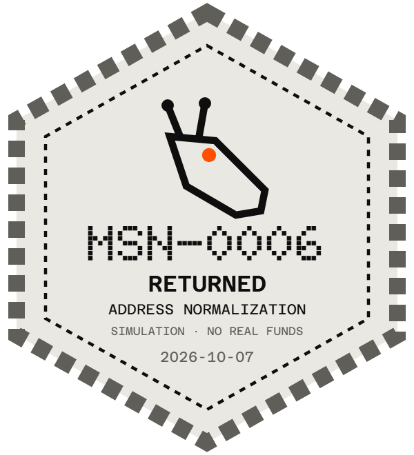

# MULE — QA de la deuxième passe

Vérifications du 7 octobre 2026. Livraison de préproduction, PR en brouillon. Aucun changement DNS ou de domaine.

## Version et déploiement

- [PR #2](https://github.com/Mule-Protocol/mule-site/pull/2), `codex/pass-2` → `main`, non fusionnée.
- Base : `45ef60d75863dd364ca1d1e76a4d272ce4843855`, fusion de la PR #1. Cette fusion a été effectuée après autorisation explicite du propriétaire dans la conversation ; son workflow a publié **la première passe**. La deuxième passe n'a pas été publiée en production.
- Commit du code audité : [`bb4e17a236d2167907129ba805ea85c46cb57eb1`](https://github.com/Mule-Protocol/mule-site/commit/bb4e17a236d2167907129ba805ea85c46cb57eb1).
- [Préproduction de branche](https://codex-pass-2.mule-site.pages.dev/).
- [Déploiement immuable audité](https://c3c969d6.mule-site.pages.dev/).
- [CI de déploiement](https://github.com/Mule-Protocol/mule-site/actions/runs/37560114498) : **Validate et Deploy Pages réussis**, sur ce commit. [Preuve JSON](qa-pass-2/ci-deploy.json).
- [CI de PR](https://github.com/Mule-Protocol/mule-site/actions/runs/37560176259).
- Les corrections des scripts de QA et les preuves sont livrées dans le commit documentaire suivant ; elles ne changent pas le code du site audité.

## Réalisation, section par section

Toutes les lignes ci-dessous correspondent au commit de code `bb4e17a`.

| Périmètre | Résultat | Fichiers principaux |
| --- | --- | --- |
| 5.2 Problème | Texte du brief, barré orange de « hope » à l'entrée | `src/components/Problem.astro`, `src/scripts/section-motion.ts` |
| 5.4 Console | Trois modèles × deux comportements, cinq étapes, faux hashes aléatoires explicitement marqués, aucun explorateur, tampon et CTA vers l'écusson | `src/components/Console.astro`, `src/lib/run-mission.ts`, `src/scripts/console.ts` |
| Interface M-1 | `runMission(template, behavior): AsyncIterable<Step>` ; présentation et temporisation restent chez le consommateur, moteur sans réseau | `src/lib/run-mission.ts` |
| 5.5 Écusson | Hexagone, silhouette, numéro, statut, modèle et date UTC ; partage X ; export canvas PNG 600×660 | `src/scripts/console.ts`, `src/data/mission.mjs` |
| Routes de partage | HTML `/m/[id]`, PNG 1200×630 `/m/[id]/og.png`, métadonnées dynamiques ; `workers-og` et police Azeret Mono embarquée, sans téléchargement de police à l'exécution | `functions/m/[id].ts`, `functions/m/[id]/og.png.ts`, `src/server/mission-page.mjs`, `src/server/og-font.mjs`, `public/brand/mission.css` |
| 5.6 $MULE | BOND / ARBITRATE / GOVERN marqués PLANNED ; financement et avertissement exacts du brief | `src/components/HomeSections.astro` |
| 5.7 Mission log | M-0 DELIVERED, M-1 IN TRANSIT, M-2 à M-4 QUEUED ; rail au défilement | `src/components/HomeSections.astro`, `src/scripts/section-motion.ts` |
| 5.8 Telemetry | PENDING LAUNCH ; brouillage unique ; compteur partagé avec la console, en mémoire de la page uniquement, remis à zéro au rechargement | Mêmes composants et scripts, `src/scripts/console.ts` |
| 5.9 FAQ | Huit questions du brief ; accordéons natifs `details/summary`, dont la question sur le wallet | `src/components/HomeSections.astro` |
| 5.10 Footer | X, GitHub, dossier et trois pages légales ; avertissement intégral ; suppression de « Design review 01 » | `src/components/Footer.astro`, `src/data/legal.mjs` |
| Navigation | Deux CTA du héros actifs ; quatre entrées identiques sur ordinateur et mobile | `src/components/Header.astro`, `src/components/Hero.astro` |
| Dossier | Texte comparé automatiquement au prototype, sans différence après normalisation des espaces ; sommaire fixe sur ordinateur et repliable sur mobile ; carte fournie ; pied de page anti-pièce jointe conservé | `src/pages/dossier.astro`, `src/content/dossier.html`, `src/styles/dossier.css`, `src/scripts/dossier.ts` |
| Pages légales | `/legal`, `/privacy`, `/risks`, bandeau DRAFT, noindex dans les métadonnées et dans les en-têtes, y compris sur l'apex ; risques repris du dossier | `src/layouts/Legal.astro`, `src/pages/{legal,privacy,risks}.astro`, `src/content/risks.html`, `src/server/response-policy.mjs` |
| Animations | Split-flap, barré, journal, tampon/secousse, dépliage, brouillage et rail ; transitions par pas ; pause et mouvements réduits donnent le résultat fixe | `src/scripts/{site,console,section-motion}.ts`, `src/styles/pass-2.css` |
| Corrections de première passe | Reprise sur la carte dont le haut est le plus proche de 72 px ; annotation 6/6 au-dessus des antennes ; espace sous le rail mobile réduit de 180 px | `src/scripts/site.ts`, `src/components/Lifecycle.astro`, `src/styles/pass-2.css` |
| Référencement | Sitemap limité à l'accueil et au dossier ; canoniques et métadonnées des nouvelles pages ; préproduction noindex | `src/pages/sitemap.xml.ts`, `src/layouts/Base.astro`, `src/server/mission-page.mjs` |
| Performance | Une feuille de style externe mutualisée, préchargement prioritaire de la police du titre | `astro.config.mjs`, `src/layouts/Base.astro` |

Le dossier garde notamment ses propres statuts M-0/M-1 et sa date de version, même s'ils diffèrent de ceux demandés pour l'accueil : son texte devait rester inchangé. Seule la structure HTML des titres et en-têtes de tableau a été améliorée pour l'accessibilité.

## Sécurité et limites fonctionnelles

- Format accepté : exactement quatre chiffres, `s` ou `r`, `inv`/`con`/`adr`, date réelle `AAAAMMJJ`. Exemple : `0042-s-inv-20261007`. Une date impossible, une casse différente, du texte ajouté, des caractères Unicode substitués, une injection ou un format incomplet donnent une réponse 404 constante. Les paramètres de query ne sont pas utilisés.
- `LAUNCHED = false`, `CONTRACT_ADDRESS = null`. Aucun wallet, lien de trading, formulaire libre, cookie ou mesure d'audience ajouté. Les identifiants séquentiels sont des identifiants de simulation, pas une preuve de transaction ni une garantie d'unicité entre visiteurs.
- CSP `style-src 'self'` et `script-src 'self' https://static.cloudflareinsights.com` conservée, sans `unsafe-inline`. Aucun style ou script inline dans le HTML livré. Les objets de style internes au moteur de rendu de PNG ne sont pas servis comme HTML.
- HSTS, DENY, nosniff, referrer policy et permissions policy appliqués aussi aux réponses de mission et d'image. Image : `max-age=86400, s-maxage=604800` ; HTML mission : `max-age=3600` ; identifiant invalide : `no-store`.
- `_routes.json` et ses exclusions sont conservés ; `/m/*` est bien exécuté par les Functions, vérifié localement et sur la préproduction.
- Police embarquée sous licence SIL OFL 1.1, licence fournie dans `public/brand/Azeret-Mono-LICENSE.txt`.
- Contrôle par motifs des 80 fichiers candidats avant publication : aucun jeton Cloudflare/GitHub ou bloc de clé privée détecté. `npm install` : zéro vulnérabilité signalée.

## Checklist QA de la section 8

| Contrôle | État et preuve / limite |
| --- | --- |
| 360, 375, 768 et 1440 px, sans débordement de page | **FAIT**, accueil, dossier, trois pages légales et mission. Les larges tableaux/diagrammes du dossier gardent leur défilement interne. [Résultats live](qa-pass-2/report.json) |
| Chrome / Chromium ordinateur et dimensions mobiles | **FAIT** avec Chromium Playwright ; inspection complémentaire dans le navigateur intégré |
| iOS Safari, Android Chrome sur appareil physique, Firefox, Safari macOS | **NON VÉRIFIÉ** : appareils et navigateurs correspondants non disponibles dans l'environnement utilisé ; les dimensions mobiles ne prouvent pas leur compatibilité |
| Six configurations de console | **FAIT**, 24 exécutions sur la préproduction : trois modèles × deux comportements × quatre largeurs |
| Journal progressif et pause pendant une exécution | **FAIT**, progression observée avant la pause ; pause supprime l'attente et montre le résultat fixe |
| Mouvements réduits | **FAIT**, zéro animation active, cinq étapes lisibles, absence de traînée, console et écusson fonctionnels |
| Pause/reprise du cycle | **FAIT**, [20 allers-retours](qa-pass-2/lifecycle-results.json) ; quatre reprises supplémentaires après défilement manuel, sélection de la carte la plus proche de 72 px |
| Sans JavaScript | **FAIT**, contenu accueil/dossier lisible, cinq étapes statiques, console désactivée avec explication explicite |
| Clavier et focus | **FAIT**, lancement avec Entrée, radios avec Espace, FAQ avec Entrée, sommaire mobile avec Entrée, partage focalisable avec contour visible, téléchargement avec Entrée ; menu mobile Escape/fermeture/lien testé |
| Écusson et téléchargement | **FAIT**, statut et modèle corrects, vrai fichier PNG 600×660 téléchargé aux quatre largeurs |
| Partage X | **FAIT** pour l'URL d'intent et le texte encodé, vérifiés sans publier de post |
| Carte dans un brouillon de post X | **NON VÉRIFIÉ** : aucune session X utilisée. Métadonnées, réponse image 1200×630 et rendu visuel vérifiés ; cela ne prouve pas le comportement du cache X |
| Lighthouse mobile ≥90 accueil et dossier | **FAIT en laboratoire local**, 99/100 en performance pour les deux pages, détails ci-dessous |
| LCP <2 secondes | **FAIT en laboratoire local**, 1,967 s et 1,958 s. Pas de mesure terrain ni de garantie sur tous les appareils/réseaux |
| IDs valides, invalides et injections | **FAIT**, tests unitaires et vrais 404 sur page/image en préproduction |
| En-têtes HTTPS et noindex | **FAIT** sur préproduction ; cas apex testés unitairement. Aucun domaine personnalisé modifié ou utilisé pour publier cette passe |
| CSP et erreurs JavaScript | **FAIT** pour les pages du site : aucune erreur applicative. Particularité de l'afficheur PNG de Chromium décrite ci-dessous |
| UTF-8 et absence d'encodage cassé | **FAIT**, build et inspection ; aucune occurrence d'artefacts d'encodage dans les pages générées |
| Aucun champ à compléter hors pages légales | **FAIT** dans les pages du site générées |
| Texte exact du dossier | **FAIT**, comparaison automatique avec `reference/mule-dossier.html` aux quatre largeurs |
| Liens et cartes fournis | **FAIT** pour les destinations configurées X/GitHub et les routes internes, l'exclusion des liens de trading et la carte OG du dossier ; disponibilité du compte X non auditée |
| Analytics Cloudflare | **NON ACTIVÉ**, hors périmètre, jeton non fourni pour cette passe |
| Validation juridique, identités de l'éditeur | **NON FAIT**, responsabilité du propriétaire et de son conseil ; pages en brouillon noindex |
| 2FA, propriétaires de comptes, surveillance après lancement | **NON VÉRIFIÉ**, hors périmètre de cette passe |

La navigation directe vers le fichier PNG utilise l'afficheur d'images intégré de Chromium. Celui-ci injecte trois styles que la CSP de l'image bloque : ces messages sont consignés séparément dans `imageViewerCspWarnings` du rapport. Ils ne proviennent pas d'un script ou style du site ; la CSP n'a pas été assouplie. La page de mission s'affiche correctement et le PNG téléchargé est valide.

## Lighthouse mobile

Mesure locale sur `http://127.0.0.1:4321`, site compilé et servi compressé, Chromium headless, throttling mobile Lighthouse par défaut (CPU ×4, RTT 150 ms, débit 1 638,4 kbit/s). Les mesures retenues ont été effectuées sans autre suite de tests navigateur en parallèle. Les premières mesures simultanées, perturbées par la charge CPU, ne sont pas retenues.

| Page | Performance | Accessibilité | LCP | CLS | Rapport |
| --- | ---: | ---: | ---: | ---: | --- |
| `/` | 99 | 100 | 1 967,08 ms | 0,01506 | [JSON](qa-pass-2/lighthouse-home.json) |
| `/dossier` | 99 | 100 | 1 958,06 ms | 0,00041 | [JSON](qa-pass-2/lighthouse-dossier.json) |

Le signal SEO « bloqué à l'indexation » est attendu pour la construction de préproduction. Les résultats complets Lighthouse JSON/HTML sont conservés localement dans `artifacts/pass-2/lighthouse-home/` et `artifacts/pass-2/lighthouse-dossier/`, et dans l'archive de livraison.

## Captures

Les captures de cette table viennent de la préproduction au commit `bb4e17a`. Les captures de console et d'écusson sont des captures des composants ; le dossier et la mission sont capturés en pleine page. Les largeurs indiquées sont celles de la fenêtre de test.

| Vue | 375 px | 1440 px |
| --- | --- | --- |
| Console réussie | [PNG](qa-pass-2/console-honest-375.png) | [PNG](qa-pass-2/console-honest-1440.png) |
| Console retournée | [PNG](qa-pass-2/console-dishonest-375.png) | [PNG](qa-pass-2/console-dishonest-1440.png) |
| Écusson réussi | [PNG](qa-pass-2/patch-honest-375.png) | [PNG](qa-pass-2/patch-honest-1440.png) |
| Écusson retourné | [PNG](qa-pass-2/patch-dishonest-375.png) | [PNG](qa-pass-2/patch-dishonest-1440.png) |
| Dossier | [PNG](qa-pass-2/dossier-375.png) | [PNG](qa-pass-2/dossier-1440.png) |
| `/m/0042-s-inv-20261007` | [PNG](qa-pass-2/mission-375.png) | [PNG](qa-pass-2/mission-1440.png) |
| Image OG ouverte directement | [PNG](qa-pass-2/og-in-browser-375.png) | [PNG](qa-pass-2/og-in-browser-1440.png) |
| Cycle, étape Inspect (local) | [PNG](qa-pass-2/lifecycle-375-step-4.png) | [PNG](qa-pass-2/lifecycle-1440-step-4.png) |

[Image OG originale 1200×630](qa-pass-2/og-1200x630.png). [Exemple de téléchargement canvas](qa-pass-2/download-375.png).

## Commandes reproductibles

```powershell
npm ci
npm test
npm run build
npx wrangler pages dev dist --port 8788
# Autre terminal :
node scripts/pass-2-qa.mjs
# Préproduction :
$env:QA_BASE_URL='https://codex-pass-2.mule-site.pages.dev'
$env:QA_OUTPUT='artifacts/pass-2/live'
node scripts/pass-2-qa.mjs
```

La suite du cycle utilise `node scripts/browser-qa.mjs` et `QA_OUTPUT`. Lighthouse utilise `node scripts/qa-server.mjs`, puis `node scripts/lighthouse.mjs` ; variables `QA_URL` et `QA_OUTPUT` pour choisir la page et le dossier. Ne pas lancer Lighthouse en parallèle d'autres tests navigateur.

## Champs à fournir par le propriétaire

- Identité ou raison sociale de l'éditeur, adresse, forme juridique, immatriculation et capital si applicables.
- Directeur de la publication et moyen de contact de l'éditeur.
- Contact confidentialité, confirmation par le conseil du traitement des données techniques par l'hébergeur et futur texte de mesure d'audience.
- Validation juridique des trois brouillons avant de retirer leur noindex.

L'hébergeur est renseigné : **Cloudflare, Inc., 101 Townsend St., San Francisco, California 94107, USA**. Adresse recopiée depuis la [section 15 des conditions officielles de Cloudflare](https://www.cloudflare.com/website-terms/), consultée le 7 octobre 2026. Le choix et l'API du moteur PNG reposent sur le [README officiel workers-og](https://github.com/kvnang/workers-og) ; aucune police distante n'est utilisée.

## Sorties curl

Les exports complets sont [ici](qa-pass-2/curl-headers-live.txt) et [ici pour le dossier après redirection](qa-pass-2/curl-dossier-final.txt). `/dossier` répond 308 vers `/dossier/`, puis 200 ; la canonique du dossier est bien `/dossier/`. La mission valide et son image répondent 200, la date invalide 404. Les sorties brutes suivent.

```http
curl -I https://codex-pass-2.mule-site.pages.dev/dossier
HTTP/1.1 308 Permanent Redirect
Date: Wed, 07 Oct 2026 02:06:55 GMT
Connection: keep-alive
Location: /dossier/
Strict-Transport-Security: max-age=31536000; includeSubDomains
content-security-policy: default-src 'self'; script-src 'self' https://static.cloudflareinsights.com; style-src 'self'; font-src 'self'; img-src 'self'; connect-src 'self' https://cloudflareinsights.com; object-src 'none'; base-uri 'self'; frame-ancestors 'none'; form-action 'self'; upgrade-insecure-requests
permissions-policy: camera=(), microphone=(), geolocation=(), payment=()
referrer-policy: strict-origin-when-cross-origin
x-content-type-options: nosniff
x-frame-options: DENY
x-robots-tag: noindex, nofollow
Report-To: {"group":"cf-nel","max_age":604800,"endpoints":[{"url":"https://a.nel.cloudflare.com/report/v4?s=E2aLG1PJO%2BCyU6DeLUp2VteTHeh9GEW%2BpeBEFXx70N2IqEZgFSzEERSKm7uln%2FR0vocvotl4fWGw59WERb%2Fx3NGfRYZFom0BUm1iCHn7V%2Fd11pSUVz%2BzC3493GPVNYuLENqOBNxcGmIcaVUUKcgIJHO7bZnkm6bQlrVHWrxuRw%3D%3D"}]}
Nel: {"report_to":"cf-nel","success_fraction":0.0,"max_age":604800}
Server: cloudflare
CF-RAY: a469596ed97c4e73-CDG
alt-svc: h3=":443"; ma=86400


curl -I https://codex-pass-2.mule-site.pages.dev/m/0042-s-inv-20261007
HTTP/1.1 200 OK
Date: Wed, 07 Oct 2026 02:06:55 GMT
Content-Type: text/html; charset=utf-8
Connection: keep-alive
Cache-Control: public, max-age=3600
Strict-Transport-Security: max-age=31536000; includeSubDomains
Content-Security-Policy: default-src 'self'; script-src 'self' https://static.cloudflareinsights.com; style-src 'self'; font-src 'self'; img-src 'self'; connect-src 'self' https://cloudflareinsights.com; object-src 'none'; base-uri 'self'; frame-ancestors 'none'; form-action 'self'; upgrade-insecure-requests
Permissions-Policy: camera=(), microphone=(), geolocation=(), payment=()
Referrer-Policy: strict-origin-when-cross-origin
X-Content-Type-Options: nosniff
X-Frame-Options: DENY
X-Robots-Tag: noindex, nofollow
Report-To: {"group":"cf-nel","max_age":604800,"endpoints":[{"url":"https://a.nel.cloudflare.com/report/v4?s=5T47Pm08tWAeYq%2B8%2FRcRq4mCs3tZSsVdWI7jZEgxEfDsxWIk8G7lsn8HNC%2BSzLXNT7sghOHd1HjC8yQ%2Ft0WSOGkeALtLdXFB6Hb7%2Fx%2Br6xQSj5ELHK1VdGpSh7G3CIwi8BGWuG%2FejsI09rtDt0t%2BE3w%2F4pFUoprj4rVrozyNQg%3D%3D"}]}
Nel: {"report_to":"cf-nel","success_fraction":0.0,"max_age":604800}
Server: cloudflare
CF-RAY: a469596f7d6b0490-CDG
alt-svc: h3=":443"; ma=86400


curl -I https://codex-pass-2.mule-site.pages.dev/m/0042-s-inv-20260229
HTTP/1.1 404 Not Found
Date: Wed, 07 Oct 2026 02:06:56 GMT
Content-Type: text/plain; charset=utf-8
Connection: keep-alive
Cache-Control: no-store
Strict-Transport-Security: max-age=31536000; includeSubDomains
Content-Security-Policy: default-src 'self'; script-src 'self' https://static.cloudflareinsights.com; style-src 'self'; font-src 'self'; img-src 'self'; connect-src 'self' https://cloudflareinsights.com; object-src 'none'; base-uri 'self'; frame-ancestors 'none'; form-action 'self'; upgrade-insecure-requests
Permissions-Policy: camera=(), microphone=(), geolocation=(), payment=()
Referrer-Policy: strict-origin-when-cross-origin
X-Content-Type-Options: nosniff
X-Frame-Options: DENY
X-Robots-Tag: noindex, nofollow
Report-To: {"group":"cf-nel","max_age":604800,"endpoints":[{"url":"https://a.nel.cloudflare.com/report/v4?s=PKsjOCCcDxKsj146JEWDU2Wexrtoz9Toonx1mANASFH7OS1yYCyCdVZfCYzmktL8SxhO51df7g%2BmnANPoFKN2aC1CB7yGkeHS7yU%2BI%2BZNYCfkDLwZl1VXOu0ROZZc8C%2FYnqB82UwUTT9hnvGvgTJ%2BadaMRm2rCrmS5BijkMXjA%3D%3D"}]}
Nel: {"report_to":"cf-nel","success_fraction":0.0,"max_age":604800}
Server: cloudflare
CF-RAY: a4695970292fd9b9-CDG
alt-svc: h3=":443"; ma=86400


curl -I https://codex-pass-2.mule-site.pages.dev/m/0042-s-inv-20261007/og.png
HTTP/1.1 200 OK
Date: Wed, 07 Oct 2026 02:06:56 GMT
Content-Type: image/png
Connection: keep-alive
Cache-Control: public, max-age=86400, s-maxage=604800
Strict-Transport-Security: max-age=31536000; includeSubDomains
Content-Security-Policy: default-src 'self'; script-src 'self' https://static.cloudflareinsights.com; style-src 'self'; font-src 'self'; img-src 'self'; connect-src 'self' https://cloudflareinsights.com; object-src 'none'; base-uri 'self'; frame-ancestors 'none'; form-action 'self'; upgrade-insecure-requests
Permissions-Policy: camera=(), microphone=(), geolocation=(), payment=()
Referrer-Policy: strict-origin-when-cross-origin
X-Content-Type-Options: nosniff
X-Frame-Options: DENY
X-Robots-Tag: noindex, nofollow
Report-To: {"group":"cf-nel","max_age":604800,"endpoints":[{"url":"https://a.nel.cloudflare.com/report/v4?s=PUwvC%2BDCs4hgPi4E0P2HaVdmrBY3C1FWNy0EB1bZ4o0CSTfFLtvWfjr%2Bp98NqBp0emWlBgQQwRFvLo8Yolo9wwK%2BQF0HTlBTHZDZnoQghJSV10DZ6w%2FO6ApeHpXUMCGUA7Ke%2Bls9ateqt7keWe9DvS51G83%2B1c2Gw1QfbbfYzg%3D%3D"}]}
Nel: {"report_to":"cf-nel","success_fraction":0.0,"max_age":604800}
Server: cloudflare
CF-RAY: a46959716827d125-CDG
alt-svc: h3=":443"; ma=86400


```

```http
# curl -I https://codex-pass-2.mule-site.pages.dev/dossier/
HTTP/1.1 200 OK
Date: Wed, 07 Oct 2026 02:07:26 GMT
Content-Type: text/html; charset=utf-8
Connection: keep-alive
Cache-Control: public, max-age=0, must-revalidate
ETag: "f026e8a6739c2743f4f6abff96f132c2"
Strict-Transport-Security: max-age=31536000; includeSubDomains
content-security-policy: default-src 'self'; script-src 'self' https://static.cloudflareinsights.com; style-src 'self'; font-src 'self'; img-src 'self'; connect-src 'self' https://cloudflareinsights.com; object-src 'none'; base-uri 'self'; frame-ancestors 'none'; form-action 'self'; upgrade-insecure-requests
permissions-policy: camera=(), microphone=(), geolocation=(), payment=()
referrer-policy: strict-origin-when-cross-origin
x-content-type-options: nosniff
x-frame-options: DENY
x-robots-tag: noindex, nofollow
Report-To: {"group":"cf-nel","max_age":604800,"endpoints":[{"url":"https://a.nel.cloudflare.com/report/v4?s=hm%2Fe8OUL%2FDBR%2FY0LfvWgOPCQx6BPOS8tfSR20TLBi4zFUVFDBT%2BDNMBfEwZxDm%2Fit1r05H0Df3hYn5vAGi8mCDwNfPtx4dr%2BCtKhW6xUyN8Jf4Jy%2B1x40FvrFJX2nWCakxzODAUybNp%2Bti2gW7MMtKEpo%2FObiziLda2Pr02IGg%3D%3D"}]}
Nel: {"report_to":"cf-nel","success_fraction":0.0,"max_age":604800}
Server: cloudflare
CF-RAY: a4695a2b6dce52be-CDG
alt-svc: h3=":443"; ma=86400


```


## Corrections de review

Cette section complète la QA initiale ci-dessus et décrit la version corrigée. Les résultats locaux de la première livraison ne remplacent pas les mesures réseau ci-dessous.

### Version et périmètre

- Nouveau commit de code : [a7fa8731346b34e550656ff7f90912220ad08a1a](https://github.com/Mule-Protocol/mule-site/commit/a7fa8731346b34e550656ff7f90912220ad08a1a), ajouté après affd901, sans réécriture de l'historique.
- PR #2 maintenue en brouillon sur codex/pass-2. Aucun changement de main, de production, de DNS ou de domaine. Aucun développement M-1.
- LAUNCHED = false et CONTRACT_ADDRESS = null. Textes, silhouette et couleurs validés conservés, hormis les changements explicitement demandés : retrait de la barre du dossier et ajout du téléphone de l'hébergeur.

### Corrections et améliorations

| Point | État et résultat | Fichiers du commit a7fa873 |
| --- | --- | --- |
| 1. Cycle mobile / console | Fait. Suppression de la marge négative ; hauteur de la zone collée adaptée à son contenu. Le rail termine réellement avant la console. | src/styles/pass-2.css |
| 2. Écussons | Fait. Numéro, statut, modèle, mention et date replacés ; mention à 5,5 unités. Marge minimale mesurée sur les six exports : 7,56 unités, après soustraction du demi-trait intérieur (0,75). Aucun texte modifié. | src/scripts/console.ts |
| 3. URL canoniques | Fait. Sitemap /dossier/ ; liens directs avec barre finale vers dossier, legal, privacy et risks. | src/pages/sitemap.xml.ts, src/components/Header.astro, Hero.astro, Footer.astro, src/server/mission-page.mjs |
| 4. noindex /m/* | Fait. En-tête et méta robots noindex, y compris sur l'apex ; le middleware couvre aussi les chemins /m/ non reconnus. OG et Twitter conservés. | src/server/mission-page.mjs, response-policy.mjs ; tests/mission.test.mjs, response-policy.test.mjs |
| 5. Cache OG | Fait. caches.default, clé GET construite à partir de l'origine et du chemin validé, sans paramètres ; HEAD et GET partagent la même entrée. Diagnostic X-MULE-OG-Cache: MISS / HIT. Écriture terminée avant la réponse. | functions/m/[id]/og.png.ts, src/server/og-cache.mjs, tests/og-cache.test.mjs |
| 6. Dates | Fait. Années 2026–2099 incluses ; date locale du visiteur pour les nouveaux écussons. Les dates du début de ce rapport étaient UTC dans la version initiale, elles ne le sont plus. | src/data/mission.mjs, tests/mission.test.mjs |
| 7. Téléphone | Fait. +1 (650) 319-8930, avec lien tel:. | src/pages/legal.astro |
| 8. Dossier | Fait. Retrait du seul header d-bar et de ses styles ; STATUS DRAFT conservé dans les métadonnées. Le test compare toujours tout le texte restant au prototype. | src/content/dossier.html, src/styles/dossier.css, scripts/pass-2-qa.mjs |

Aucune amélioration recommandée laissée de côté.

Téléphone et adresse vérifiés le 7 octobre 2026 sur la [page officielle Cloudflare, encadré « Have Questions? » et section 15](https://www.cloudflare.com/website-terms/).

Le cache évite un nouveau rendu OG en cas de HIT. Il est local au centre de données Cloudflare et ne supprime pas l'exécution de la Function ni son décompte de requêtes. Source : [documentation officielle Cache API](https://developers.cloudflare.com/workers/runtime-apis/cache/). Aucun changement de plan, de quota ou de configuration du compte.

### Tests et preuves

- 14 tests unitaires réussis (10 auparavant), dont les bornes 2026 et 2099, les années 0000/9999 rejetées, Paris à 00 h 30 et Los Angeles avant minuit, le noindex sur l'apex, le cache HEAD/GET, les paramètres ignorés, l'isolation par mission/hôte et le non-stockage des erreurs.
- Build Astro et contrôle du HTML compilé réussis : 0 erreur, 0 avertissement, 0 hint ; CSP stricte, absence de scripts/styles inline, UTF-8 et noindex des préproductions contrôlés.
- Régression locale du cycle aux largeurs 360, 375, 768 et 1440 : cinq étapes, 20 bascules pause/reprise plus défilement pendant la pause, mule cadrée, contenu accessible, mouvements réduits et sans JavaScript. [Résultat JSON](qa-pass-2-corrections/lifecycle-local.json).


- [CI de déploiement réussie](https://github.com/Mule-Protocol/mule-site/actions/runs/37563976319), [validation PR](https://github.com/Mule-Protocol/mule-site/actions/runs/37563980898). [Preuve CI](qa-pass-2-corrections/ci-deploy.json), [déploiement](qa-pass-2-corrections/deployment.json).
- [Préproduction de branche mise à jour](https://codex-pass-2.mule-site.pages.dev/), [version immuable testée](https://6a8a3baf.mule-site.pages.dev/).
- Contrôles sur la préproduction : arrivées par héros et menu à 360×740 et 375×812, plus 233 positions de défilement mobile (pas de 8 px), sans chevauchement. Vide rail → bord supérieur du label console : **72 px** dans les deux tailles. Les largeurs 768 et 1440 restent sans chevauchement. [Mesures géométriques et six écussons](qa-pass-2-corrections/browser/report.json).
- Les boîtes réelles des glyphes canvas, avec les polices chargées, sont comparées aux six côtés du polygone intérieur ; la distance est perpendiculaire au trait, pas seulement horizontale. Les fichiers téléchargés font tous 600×660 et ont aussi été inspectés visuellement.
- Régression sur la préproduction : 24 simulations, téléchargement au clavier, focus, FAQ, texte du dossier identique hors barre supprimée, TOC, absence de débordement, pages légales, mission HTML, image 1200×630, 404, pause et sans JavaScript. [Résultat JSON](qa-pass-2-corrections/regression-preview.json). Zéro erreur applicative ; les avertissements CSP de la visionneuse PNG interne de Chromium restent séparés, comme lors de la première livraison.

### Captures de la préproduction

| Taille | Héros → console | Menu → console | Défilement continu |
| --- | --- | --- | --- |
| 360×740 | [Capture](qa-pass-2-corrections/browser/console-hero-360.png) | [Capture](qa-pass-2-corrections/browser/console-menu-360.png) | [Capture](qa-pass-2-corrections/browser/console-scroll-360.png) |
| 375×812 | [Capture](qa-pass-2-corrections/browser/console-hero-375.png) | [Capture](qa-pass-2-corrections/browser/console-menu-375.png) | [Capture](qa-pass-2-corrections/browser/console-scroll-375.png) |

[Dossier avec une seule barre et STATUS DRAFT conservé](qa-pass-2-corrections/browser/dossier-header-375.png).

### Six PNG téléchargés, sans retouche

| Modèle | SETTLED | RETURNED |
| --- | --- | --- |
| Invoice to JSON |  |  |
| Contract summary |  |  |
| Address normalization |  |  |

### HTTP et preuve du cache

Requêtes du 7 octobre 2026, exécutées sur la préproduction. Aucun appel ne modifie la production. Dossier, sitemap, mission et image répondent 200 ; le sitemap contient seulement l'accueil et l'URL canonique /dossier/. Les deux appels OG successifs utilisent des paramètres différents pour vérifier qu'ils ne créent pas de nouvelles entrées : **MISS → HIT**. TTFB mesuré : **397 ms → 93 ms**, même centre de données CDG. Il s'agit d'un relevé ponctuel, pas d'une garantie de latence.

<details>
<summary>Dossier — curl -I</summary>

```text
curl -I https://codex-pass-2.mule-site.pages.dev/dossier/
HTTP/1.1 200 OK
Date: Wed, 07 Oct 2026 02:53:52 GMT
Content-Type: text/html; charset=utf-8
Connection: keep-alive
Cache-Control: public, max-age=0, must-revalidate
ETag: "8d79c00aaabd24f97e92d2ecd0f9e2aa"
Strict-Transport-Security: max-age=31536000; includeSubDomains
content-security-policy: default-src 'self'; script-src 'self' https://static.cloudflareinsights.com; style-src 'self'; font-src 'self'; img-src 'self'; connect-src 'self' https://cloudflareinsights.com; object-src 'none'; base-uri 'self'; frame-ancestors 'none'; form-action 'self'; upgrade-insecure-requests
permissions-policy: camera=(), microphone=(), geolocation=(), payment=()
referrer-policy: strict-origin-when-cross-origin
x-content-type-options: nosniff
x-frame-options: DENY
x-robots-tag: noindex, nofollow
Report-To: {"group":"cf-nel","max_age":604800,"endpoints":[{"url":"https://a.nel.cloudflare.com/report/v4?s=aOX846Vv4IewzsReHwOyMTWoSIL4pg4JHnKSwLSbApZwE2xIQKd4m9yuyLZc9AHCSj7Ga9vpl3iPm8aRXolPTVZ%2FruBajVjGUvakSPO%2FBMNlUgqt0sXlx5OAm3VfoViWljfUiJuLoKgcpVPfH7Wr0m0qhJVzAX0f2ppxwd6jkQ%3D%3D"}]}
Nel: {"report_to":"cf-nel","success_fraction":0.0,"max_age":604800}
Server: cloudflare
CF-RAY: a4699e356abe6f94-CDG
alt-svc: h3=":443"; ma=86400
```

</details>

<details>
<summary>Sitemap — curl -I</summary>

```text
curl -I https://codex-pass-2.mule-site.pages.dev/sitemap.xml
HTTP/1.1 200 OK
Date: Wed, 07 Oct 2026 02:53:53 GMT
Content-Type: application/xml
Connection: keep-alive
Cache-Control: public, max-age=0, must-revalidate
ETag: "d8c9a6e0de039da193e78051b08d885f"
Strict-Transport-Security: max-age=31536000; includeSubDomains
content-security-policy: default-src 'self'; script-src 'self' https://static.cloudflareinsights.com; style-src 'self'; font-src 'self'; img-src 'self'; connect-src 'self' https://cloudflareinsights.com; object-src 'none'; base-uri 'self'; frame-ancestors 'none'; form-action 'self'; upgrade-insecure-requests
permissions-policy: camera=(), microphone=(), geolocation=(), payment=()
referrer-policy: strict-origin-when-cross-origin
x-content-type-options: nosniff
x-frame-options: DENY
x-robots-tag: noindex, nofollow
Report-To: {"group":"cf-nel","max_age":604800,"endpoints":[{"url":"https://a.nel.cloudflare.com/report/v4?s=d6Hcz1OoaA5OTVlP3o8JH2tlGsduWQLmWMHQ9pT7HMLnrVjHlvklXv9qh6pKO8Sf2BWFHTRaXtJ9SPIprJDDwE2wfhVY%2B%2FXIjAb36yOTm4rgeKPSYKq0UlYvO2awpoK9W6K3zY1qi0K3xVd1GbE6On52BlCS24LM1fx0l%2Bkw6Q%3D%3D"}]}
Nel: {"report_to":"cf-nel","success_fraction":0.0,"max_age":604800}
Server: cloudflare
CF-RAY: a4699e36be1fd7e7-CDG
alt-svc: h3=":443"; ma=86400
```

</details>

<details>
<summary>Mission valide — curl -I</summary>

```text
curl -I https://codex-pass-2.mule-site.pages.dev/m/5817-s-adr-20261007
HTTP/1.1 200 OK
Date: Wed, 07 Oct 2026 02:53:53 GMT
Content-Type: text/html; charset=utf-8
Connection: keep-alive
Cache-Control: public, max-age=3600
Strict-Transport-Security: max-age=31536000; includeSubDomains
Content-Security-Policy: default-src 'self'; script-src 'self' https://static.cloudflareinsights.com; style-src 'self'; font-src 'self'; img-src 'self'; connect-src 'self' https://cloudflareinsights.com; object-src 'none'; base-uri 'self'; frame-ancestors 'none'; form-action 'self'; upgrade-insecure-requests
Permissions-Policy: camera=(), microphone=(), geolocation=(), payment=()
Referrer-Policy: strict-origin-when-cross-origin
X-Content-Type-Options: nosniff
X-Frame-Options: DENY
X-Robots-Tag: noindex, nofollow
Report-To: {"group":"cf-nel","max_age":604800,"endpoints":[{"url":"https://a.nel.cloudflare.com/report/v4?s=iC5Ix6mU16CsalCi8TFbu5rmoOnYCVt1TC5%2Fq9MCN%2BS7MeUZFzhaeZIPW9TWbZpmn5SeRAGcd1zu4OE5R8aPqdaaODp6zfyTkSiOsSCPnSUIKjlOMoCI%2FE%2B9rD%2Fp3VoYGNv6M93KOtCutaMZXHJQyQVvurgsyw4saHQnTVXKfw%3D%3D"}]}
Nel: {"report_to":"cf-nel","success_fraction":0.0,"max_age":604800}
Server: cloudflare
CF-RAY: a4699e387c694e30-CDG
alt-svc: h3=":443"; ma=86400
```

</details>

<details>
<summary>Image OG, premier appel — curl -I</summary>

```text
curl -I https://codex-pass-2.mule-site.pages.dev/m/5817-s-adr-20261007/og.png?review=1
HTTP/1.1 200 OK
Date: Wed, 07 Oct 2026 02:53:53 GMT
Content-Type: image/png
Connection: keep-alive
Cache-Control: public, max-age=86400, s-maxage=604800
Strict-Transport-Security: max-age=31536000; includeSubDomains
Content-Security-Policy: default-src 'self'; script-src 'self' https://static.cloudflareinsights.com; style-src 'self'; font-src 'self'; img-src 'self'; connect-src 'self' https://cloudflareinsights.com; object-src 'none'; base-uri 'self'; frame-ancestors 'none'; form-action 'self'; upgrade-insecure-requests
Permissions-Policy: camera=(), microphone=(), geolocation=(), payment=()
Referrer-Policy: strict-origin-when-cross-origin
X-Content-Type-Options: nosniff
X-Frame-Options: DENY
X-MULE-OG-Cache: MISS
X-Robots-Tag: noindex, nofollow
Report-To: {"group":"cf-nel","max_age":604800,"endpoints":[{"url":"https://a.nel.cloudflare.com/report/v4?s=z8ClgZl6%2F6yuOhsSYXwMeIJfjm9v9EAliHxj5o8Wvml3x5pIIpEUDWHuq%2B6GMyo36iBDBwwWEVzXy1Fy3xYzU6s%2Bmr8DVJ7Uko93W9ZIxYDvhJsLV3JdYab5sGSzDOeHz0DZVewMRdndtWCPv%2BqCU9QBoaGu%2FwXR%2BlSgh%2Fez3Q%3D%3D"}]}
Nel: {"report_to":"cf-nel","success_fraction":0.0,"max_age":604800}
Server: cloudflare
CF-RAY: a4699e39dece97ce-CDG
alt-svc: h3=":443"; ma=86400

time_starttransfer=0.397371
```

</details>

<details>
<summary>Image OG, second appel — curl -I</summary>

```text
curl -I https://codex-pass-2.mule-site.pages.dev/m/5817-s-adr-20261007/og.png?review=2
HTTP/1.1 200 OK
Date: Wed, 07 Oct 2026 02:53:54 GMT
Content-Type: image/png
Content-Length: 42126
Connection: keep-alive
CF-Ray: a4699e3cb99bad3a-CDG
CF-Cache-Status: HIT
Accept-Ranges: bytes
Age: 0
Cache-Control: public, max-age=86400, s-maxage=604800
Last-Modified: Wed, 07 Oct 2026 02:53:53 GMT
Server: cloudflare
Strict-Transport-Security: max-age=31536000; includeSubDomains
Content-Security-Policy: default-src 'self'; script-src 'self' https://static.cloudflareinsights.com; style-src 'self'; font-src 'self'; img-src 'self'; connect-src 'self' https://cloudflareinsights.com; object-src 'none'; base-uri 'self'; frame-ancestors 'none'; form-action 'self'; upgrade-insecure-requests
Permissions-Policy: camera=(), microphone=(), geolocation=(), payment=()
Referrer-Policy: strict-origin-when-cross-origin
X-Content-Type-Options: nosniff
X-Frame-Options: DENY
X-MULE-OG-Cache: HIT
X-Robots-Tag: noindex, nofollow
Report-To: {"group":"cf-nel","max_age":604800,"endpoints":[{"url":"https://a.nel.cloudflare.com/report/v4?s=MR87emdtzX8pg2S0GzPFMcr9pfXIfNs62GSva3i4iflpUjX8dV5eptSrK8p5pZi%2BjtpmXNb%2FqM7KZKg45ZJZChNSOGp2wjGjF5Ajk3zt5vK%2BU9Z%2BxtYmoj21eab9CgKelCW5ii3IJi1HMKOTo1rV8CZKgWUNpsDDp3yAwVrwBQ%3D%3D"}]}
Nel: {"report_to":"cf-nel","success_fraction":0.0,"max_age":604800}
alt-svc: h3=":443"; ma=86400

time_starttransfer=0.092780
```

</details>

Contenu du sitemap :

```xml
<?xml version="1.0" encoding="UTF-8"?><urlset xmlns="http://www.sitemaps.org/schemas/sitemap/0.9"><url><loc>https://muleprotocol.com/</loc></url><url><loc>https://muleprotocol.com/dossier/</loc></url></urlset>
```


### Lighthouse mobile sur la préproduction réelle

Mesures uniques successives, navigateur isolé et sans autre suite de tests en parallèle, le 7 octobre 2026 à 02:55 et 02:56 UTC. URL de branche HTTPS, réseau réel jusqu'à Cloudflare ; simulation mobile Lighthouse avec RTT 150 ms, débit 1 638,4 kbit/s et CPU ×4. Ce ne sont ni des résultats localhost ni des mesures sur téléphone physique.

| URL | Performance | Accessibilité | LCP | CLS | Critères |
| --- | ---: | ---: | ---: | ---: | --- |
| https://codex-pass-2.mule-site.pages.dev/ | 98 | 100 | 2 275 ms | 0,0151 | ≥90 atteint ; LCP <2 s non atteint |
| https://codex-pass-2.mule-site.pages.dev/dossier/ | 97 | 100 | 2 295 ms | 0,00037 | ≥90 atteint ; LCP <2 s non atteint |

[Résultat accueil](qa-pass-2-corrections/lighthouse-home.json) · [Résultat dossier](qa-pass-2-corrections/lighthouse-dossier.json).

Le LCP réseau confirme l'ordre de grandeur de 2,3 s relevé par la review. La cible initiale <2 s reste donc **non validée** ; les chiffres locaux de la livraison initiale ne doivent pas être employés pour la déclarer atteinte. Cette passe corrige les défauts demandés et fournit la mesure réseau, sans lancer une refonte de performance hors périmètre. L'échec de l'audit d'indexabilité est attendu sur la préproduction noindex.

### Limites et éléments à fournir

- Mesures de géométrie et de clavier sur Chromium automatisé ; Safari/iOS et Android physiques non vérifiés dans cette passe.
- Cache MISS/HIT observé au centre de données CDG. Aucun test de saturation ou de quota ; aucune garantie de cache déjà chaud dans un autre centre.
- noindex de l'apex vérifié par tests unitaires du middleware et des réponses HTML. Ces corrections ne sont pas encore déployées en production ; la vérification HTTP porte uniquement sur la préproduction.
- Aucun message publié sur X ; intent web et image OG vérifiés, mais récupération par le robot X non testée.
- Champs restant à fournir dans /legal/ : identité/raison sociale, adresse, forme juridique/immatriculation/capital si applicable, directeur de publication, contact éditeur. Les brouillons restent soumis au conseil du propriétaire.
- Aucun test n'est déclaré réussi sans exécution ; l'écart LCP ci-dessus reste explicite.

Les preuves et le présent complément sont ajoutés dans le commit documentaire suivant le commit de code a7fa873, sur la même PR en brouillon.


## Correction LCP

### Résultat et commits

La réserve LCP est levée sur les mesures de cette passe : médiane **1,718 s sur l'accueil** et **1,638 s sur /dossier/**. Les six passages après correction obtiennent **99/100 en performance et 100/100 en accessibilité**. L'instance statique suffit : aucune séparation ni suppression supplémentaire de CSS n'a été nécessaire.

- Avant : [déploiement immuable 6a8a3baf](https://6a8a3baf.mule-site.pages.dev/), code a7fa8731346b34e550656ff7f90912220ad08a1a. La branche partait du commit documentaire 3ed3617a0333915e175e176f388ce496d3f6a476.
- Correctif : [43db0561dde3f1d69e41712287e1baf279f4dd2e](https://github.com/Mule-Protocol/mule-site/commit/43db0561dde3f1d69e41712287e1baf279f4dd2e), `perf: subset static Archivo titles to reduce mobile LCP`.
- Après : **[https://6e6ff294.mule-site.pages.dev/](https://6e6ff294.mule-site.pages.dev/)** et **[son dossier](https://6e6ff294.mule-site.pages.dev/dossier/)**. Toutes les mesures « après » et captures ci-dessous utilisent cette URL immuable.
- [CI du commit et déploiement — 37633702519](https://github.com/Mule-Protocol/mule-site/actions/runs/37633702519) : Validate et Deploy Pages réussis. [CI PR — 37633706510](https://github.com/Mule-Protocol/mule-site/actions/runs/37633706510) : réussie. [Preuve JSON des jobs](qa-lcp/ci-code.json).
- Le présent rapport et ses preuves constituent le commit documentaire suivant, intitulé `docs: record immutable LCP measurements and visual comparisons`. Ce commit ne modifie pas le site exécuté. Les deux commits sont ajoutés à `codex/pass-2`, sans réécriture d'historique. PR #2 conservée en brouillon, sans fusion, production, DNS ou M-1.

Les résultats antérieurs à 2,3 s ci-dessus restent des mesures historiques ; ils ne décrivent pas le correctif 43db056.

### Police et fichiers

| Caractéristique | Avant | Après |
| --- | --- | --- |
| WOFF2 | Archivo latin variable Fontsource 5.3.0 | Instance statique wdth=125, wght=800 |
| Taille exacte | 90 104 octets | **8 184 octets**, sous 25 Ko |
| Réduction | — | **81 920 octets, soit 90,92 %** |
| Axes variables | wght, wdth | Aucun : tables fvar/gvar absentes |
| Auto-hébergement / preload | Oui | Oui, font-display: swap conservé |

Source verrouillée par la dépendance existante `@fontsource-variable/archivo@5.3.0`. Génération reproductible dans [scripts/build-title-font.py](../scripts/build-title-font.py), avec les contours existants et le hinting conservé. Les API officielles [FontTools instancer](https://fonttools.readthedocs.io/en/latest/varLib/instancer.html) et [FontTools subset](https://fonttools.readthedocs.io/en/latest/subset/index.html) servent à produire l'instance puis le sous-ensemble. Versions utilisées : FontTools 4.66.1, Brotli 1.2.0, Zopfli 0.4.3. Le build/CI utilise le binaire commité, sans Python ni téléchargement de police.

- [WOFF2 statique](../public/brand/fonts/archivo-125-800-latin.woff2) : 104 caractères Unicode / 148 glyphes ; ASCII imprimable (lettres, chiffres, ponctuation, $), espace insécable, ·, –/—, apostrophes et citations typographiques, ….
- [OFL.txt](../public/brand/fonts/OFL.txt) : licence SIL OFL 1.1 du paquet original, à côté du fichier.
- `✓` est absent de l'Archivo d'origine et n'apparaît dans aucun des 46 titres Archivo capturés. Son fallback existant ailleurs est conservé ; aucun glyphe de remplacement n'est inventé.
- [Base.astro](../src/layouts/Base.astro) : nouvelle cible de preload, suppression de l'import variable.
- [site.css](../src/styles/site.css) : même famille Archivo, déclaration fixe 800 / 125 %, URL locale. Aucune autre règle de rendu modifiée.
- [lighthouse.mjs](../scripts/lighthouse.mjs) : attendre la fermeture du navigateur entre mesures, sans modifier les paramètres Lighthouse.
- [lcp-series.mjs](../scripts/lcp-series.mjs), [lcp-visual.mjs](../scripts/lcp-visual.mjs), [lcp-compare.mjs](../scripts/lcp-compare.mjs) : séries de mesures et comparaisons reproductibles.

[Tailles, axes et SHA-256](qa-lcp/font.json). Le fichier téléchargé en préproduction répond 200, pèse 8 184 octets et possède le même SHA-256 que le fichier commité : `8aa4a2cc0df5861def922e3c403ef71e31eaa81962eadb8aac1472ab2da2f729`.

### Lighthouse : trois passages par page avant et après

Mesures le 7 octobre 2026 : avant de 13:50 à 13:52 UTC, après de 14:08 à 14:11 UTC. Lighthouse **13.5.0**, Chromium **153**, mobile émulé 412 × 823, throttling simulé identique : RTT 150 ms, débit 1 638,4 kbit/s, CPU ×4. Un navigateur neuf à chaque passage, séries séquentielles sans autre test de navigateur ni build en parallèle. Ressources chargées sur le réseau réel depuis Cloudflare ; ce ne sont pas des mesures sur téléphone physique.

| Version | Page | Passage | LCP (ms) | Performance /100 | Accessibilité /100 |
| --- | --- | ---: | ---: | ---: | ---: |
| Avant | / | 1 | 2298.167 | 88 | 100 |
| Avant | / | 2 | 2334.917 | 95 | 100 |
| Avant | / | 3 | 2346.425 | 95 | 100 |
| **Avant** | **/** | **Médiane** | **2334.917** | **95** | **100** |
| Avant | /dossier/ | 1 | 2290.906 | 98 | 100 |
| Avant | /dossier/ | 2 | 2345.882 | 97 | 100 |
| Avant | /dossier/ | 3 | 2296.708 | 97 | 100 |
| **Avant** | **/dossier/** | **Médiane** | **2296.708** | **97** | **100** |
| Après | / | 1 | 1714.398 | 99 | 100 |
| Après | / | 2 | 1718.003 | 99 | 100 |
| Après | / | 3 | 1755.723 | 99 | 100 |
| **Après** | **/** | **Médiane** | **1718.003** | **99** | **100** |
| Après | /dossier/ | 1 | 1614.993 | 99 | 100 |
| Après | /dossier/ | 2 | 1716.261 | 99 | 100 |
| Après | /dossier/ | 3 | 1638.315 | 99 | 100 |
| **Après** | **/dossier/** | **Médiane** | **1638.315** | **99** | **100** |

Médiane calculée séparément pour chaque métrique, sans exclure de passage. Le premier score accueil avant (88) est conservé. **Les six passages après satisfont individuellement LCP <2 000 ms, performance ≥90 et accessibilité 100.** CLS après : au plus 0,01518 sur l'accueil et 0,000374 sur le dossier, sous le plafond 0,05. L'échec SEO d'indexabilité est attendu sur une préproduction noindex.

[Mesures et paramètres avant](qa-lcp/lighthouse-before.json) · [après](qa-lcp/lighthouse-after.json). Rapports complets JSON + HTML de chaque passage : [archive avant](qa-lcp/lighthouse-before-reports.zip) · [archive après](qa-lcp/lighthouse-after-reports.zip).

### Captures avant / après et fidélité visuelle

Captures Chromium de chaque version immuable à hauteur 900 px, polices chargées, mouvements réduits pour figer les animations. Quatre vues de page et **46 captures de titres par version** sont conservées. Égalité exacte vérifiée des boîtes des titres, propriétés typographiques, textes des pages et URL/type/ordre des scripts. Aucun débordement ni erreur JavaScript lors de ces captures.

| Page et largeur | Avant | Après |
| --- | --- | --- |
| Accueil 375 px | [PNG](qa-lcp/visual-before/home-375.png) | [PNG](qa-lcp/visual-after/home-375.png) |
| Accueil 1440 px | [PNG](qa-lcp/visual-before/home-1440.png) | [PNG](qa-lcp/visual-after/home-1440.png) |
| Dossier 375 px | [PNG](qa-lcp/visual-before/dossier-375.png) | [PNG](qa-lcp/visual-after/dossier-375.png) |
| Dossier 1440 px | [PNG](qa-lcp/visual-before/dossier-1440.png) | [PNG](qa-lcp/visual-after/dossier-1440.png) |

Inspection visuelle : aucune différence visible de mise en page, d'épaisseur ou de retours à la ligne. **Les pixels ne sont pas strictement identiques** : de petites variations d'anticrénelage des contours apparaissent après l'instanciation statique. Sur les vues complètes : 49 pixels changent pour l'accueil 375, 455 pour l'accueil 1440, 16 pour le dossier 375 et 475 pour le dossier 1440 (au plus 0,037 % des pixels). Ne pas présenter cela comme une identité binaire. Les 50 captures après en ligne sont identiques octet par octet aux 50 captures locales inspectées.

[Métriques et texte avant](qa-lcp/visual-before/visual.json) · [après](qa-lcp/visual-after/visual.json) · [comparaison complète de chaque titre](qa-lcp/visual-comparison.json). Les fichiers `*-title-N.png` dans ces deux dossiers couvrent également les titres sous le premier écran.

### Vérifications et limites

- **14 tests unitaires réussis** ; build Astro et contrôles de sortie réussis. Dernier build local : 0 erreur, 0 avertissement, 0 hint. CI du commit réussie.
- Aucun texte modifié ; bundles JavaScript et ordre identiques dans les quatre comparaisons. Aucun style ni script inline ajouté au HTML. Les écritures CSSOM existantes pendant les animations sont inchangées.
- [En-têtes accueil](qa-lcp/headers-home.txt) et [dossier](qa-lcp/headers-dossier.txt) : HTTP 200, CSP inchangée avec `style-src 'self'` sans `unsafe-inline`, polices locales et noindex de préproduction.
- `LAUNCHED=false`, `CONTRACT_ADDRESS=null` ; aucun changement à la console, aux Functions, au workflow, aux domaines ou à la production.
- Chromium automatisé ; Safari/iOS et Android physiques non revérifiés. Ces mesures datées ne garantissent pas le résultat sur tous les réseaux.
- La suite fonctionnelle intégrale de la passe précédente n'est pas réexécutée pour cette modification de police : tests unitaires, build, comparaisons visuelles/textes/scripts et Lighthouse couvrent le changement actuel.

Reproduction :

```sh
node scripts/lcp-series.mjs https://6a8a3baf.mule-site.pages.dev artifacts/lcp/before
node scripts/lcp-series.mjs https://6e6ff294.mule-site.pages.dev artifacts/lcp/after
node scripts/lcp-visual.mjs https://6a8a3baf.mule-site.pages.dev artifacts/lcp/visual-before
node scripts/lcp-visual.mjs https://6e6ff294.mule-site.pages.dev artifacts/lcp/visual-after
node scripts/lcp-compare.mjs artifacts/lcp/visual-before artifacts/lcp/visual-after artifacts/lcp/visual-comparison.json
```
