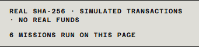
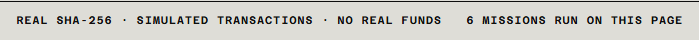

# M-1.2 B — Console réelle, preuves de revue

Date : 8 octobre 2026 (Europe/Paris). Développement local et GitHub uniquement ; aucune publication Cloudflare ni fusion.

## Provenance et périmètre

- Base `mule-site/main` : `b49a4cf207e5140c2770d169a85ce97aa065d1ba` ; branche de livraison : `codex/real-logic-console`.
- [PR #31 de mule fusionnée](https://github.com/Mule-Protocol/mule/pull/31), commit de fusion exact : **`ecfb8350e6ede380eb2ad83174576ef6580562e1`**.
- [Spécification suivie à ce commit](https://github.com/Mule-Protocol/mule/blob/ecfb8350e6ede380eb2ad83174576ef6580562e1/docs/spec/M1_2_REAL_LOGIC_CONSOLE.md), partie B ; [issue de suivi #27](https://github.com/Mule-Protocol/mule/issues/27).
- [SOURCE.md](../../src/vendor/mule-console-core/SOURCE.md) consigne ce SHA complet, les deux URL immuables et l'empreinte **`11fd73a2ee21035ff8fe07f696e0c13ef979bed055f8ce4bb33c58ffc368f47c`**.
- [Petite PR séparée mule #32](https://github.com/Mule-Protocol/mule/pull/32) : commit `1311039e4e3aa4e8d2e684ae737aef890699140d`, uniquement la règle `.gitattributes` pour `packages/console-core/dist/** -text`. Le bundle lui-même est inchangé.

Commits de code : `a615edae2667d7badb34b0757fbe17471f5b2167` (vendoring et octets), `5ee47e3e67badd1d7a5950871a1d1416fa5d203a` (console), `bcbe501238fe039dbec7975eee43a55d5ab72fa8` (tests et CI). Le commit suivant publie ces preuves et cette documentation.

Le module est chargé par import dynamique à la première itération déclenchée par le lancement. Il réutilise les fixtures, l'agent, le validateur, le JSON canonique, WebCrypto et le modèle validé de la partie A. Le navigateur n'exécute pas le programme Solana et ne possède aucun wallet.

Le journal conserve ses cinq stations, ses délais de 800 ms et son format. Les transactions portent `SIM-TX-…`, les empreintes courtes `sha256:…`, et le panneau `Inspection report` présente le rapport JSON et les trois empreintes complètes, via `textContent`. La phrase demandée sous la console est ajoutée exactement.

## Octets et fins de ligne

`src/vendor/mule-console-core/** -text` protège les octets sur tous les checkouts. L'updater exige un SHA Git complet de 40 caractères, télécharge uniquement les deux fichiers à ce commit, vérifie les buffers binaires avant écriture et n'effectue aucune normalisation de texte. Une interruption entre deux remplacements est détectée par la vérification suivante.

Les tests et chaque build vérifient hors ligne le SHA du fichier brut contre `SOURCE.md` et le sidecar. Tout octet CR est refusé, **même si les deux empreintes sont recalculées pour correspondre au fichier altéré**. Les cas de corruption, mauvais SHA, métadonnées incohérentes, URL de branche et échec de validation du téléchargement sont testés.

Un [checkout neuf avec `core.autocrlf=true`](autocrlf-checkout.json), effectué au commit `bcbe501238fe039dbec7975eee43a55d5ab72fa8`, conserve les quatre fichiers vendor au même octet près, avec zéro CR. Le clone temporaire est ensuite supprimé.

## Résultats locaux

| Contrôle | Résultat |
| --- | --- |
| Tests main avant modification | 39/39 |
| Tests après intégration | **50/50** : 38 tests conservés, 10 d'intégrité, 2 d'adaptateur couvrant les 6 scénarios |
| Build avec réseau Node interdit | Réussi ; 0 erreur, 0 warning, 1 suggestion de style TypeScript dans un test |
| Chromium 153.0.8010.12 | **15 lancements réussis** : 6 scénarios en ligne, 6 hors ligne, 2 captures desktop, 1 rythme normal |
| Erreurs navigateur / console / violations CSP | **0 / 0 / 0** |
| Module chargé ou préchargé à l'ouverture de la page | **0** |
| Tentatives réseau pendant l'exécution du module | **0**, échecs et accès au cache inclus |
| Rapport aux largeurs 360 / 375 / 768 / 1440 px | Aucun débordement horizontal de page ; défilement horizontal du JSON vérifié aux quatre largeurs |
| Rythme normal | Intervalles 800–813 ms ; cinq délais conservés, environ 4,03 s du premier état à la fin |

Preuves : [avant](before/browser.json), [après](after/browser.json), [périmètre et résultats locaux](scope-check.json), [harnais navigateur](../../scripts/real-logic-console-qa.mjs).

| Scénario | Message exact observé | Résultat en ligne et hors ligne |
| --- | --- | --- |
| invoice / honest | 6/6 FIELDS VALID | Settled |
| invoice / dishonest | 5/6 · MISSING: total_amount | Returned |
| contract / honest | 5/5 FIELDS VALID | Settled |
| contract / dishonest | 4/5 · MISSING: governing_law | Returned |
| address / honest | 12/12 ROWS VALID | Settled |
| address / dishonest | 11/12 · INVALID POSTCODE, ROW 7 | Returned |

Le test compare chaque report_hash au vecteur approuvé de la partie A et le recalcule indépendamment depuis le JSON affiché. Il contrôle aussi la remise à zéro du panneau au lancement suivant, les hash de critères/livraison, l'absence de faux identifiants ou de chaîne ressemblant à une adresse/signature dans le journal, et le statut final.

### Limite exacte de la mesure réseau

Le premier clic télécharge nécessairement le module différé. Il prépare également les deux images de patch déjà présentes dans le site. Toutes ces ressources ont fini de charger **avant la fin de réception du chunk console-core**, borne antérieure à son exécution. Aucune nouvelle requête ne commence entre cette borne et la clôture complète du journal et du patch. Pour les lancements suivants et les six scénarios hors ligne, zéro tentative est exigé **dès le clic**.

Le test observe CDP `Network.requestWillBeSent`, y compris les échecs, et recoupe avec `PerformanceResourceTiming`. Il ne remplace pas les API réseau du produit et ne démarre pas sa mesure au premier `[01]`, qui arrive après les calculs préparatoires. La revue a permis de corriger cette borne du harnais avant publication des résultats.

Le serveur QA est uniquement loopback. Il applique la CSP du site, en retirant seulement `upgrade-insecure-requests` pour HTTP local. La politique de production, ses domaines et les fichiers CSP restent inchangés. Les captures sont des émulations Chromium de viewport, pas des mesures sur téléphones physiques.

## Lighthouse mobile et taille

Trois mesures séquentielles par version, avec Lighthouse 13 et les mêmes réglages mobiles simulés. Le build main est préservé dans un répertoire indépendant. Aucun autre test navigateur ne tourne pendant ces mesures. Le serveur local applique la politique d'en-têtes apex pour éviter que le `noindex` d'une preview ne fausse le score SEO ; aucun réglage de production n'est changé.

| Version | Performance, trois passages | Médiane P / A / BP / SEO | LCP médian | CLS médian |
| --- | --- | --- | --- | --- |
| Main avant | 81 / 100 / 88 | **88 / 100 / 100 / 100** | 1 392 ms | 0,0151 |
| Après | 100 / 100 / 100 | **100 / 100 / 100 / 100** | 1 441 ms | 0,0151 |

Les trois passages après retrouvent le score 100/100/100/100 attendu. La variabilité observée avant est conservée, et ne doit pas être présentée comme un gain de performance causé par cette modification. [Toutes les mesures avant](lighthouse-before.json) et [après](lighthouse-after.json) incluent les métriques, versions, throttling et audits non parfaits.

| Taille | Octets |
| --- | ---: |
| Module upstream conservé, brut / gzip niveau 9 | 72 364 / 13 134 |
| Chunk émis par Vite, brut / gzip niveau 9 | 69 500 / 11 579 |
| Corps HTTP gzip du chunk mesuré au premier lancement | **11 608** |
| Premier lancement froid complet après : module + deux images existantes | 56 634 de corps HTTP gzip |
| Premier lancement honnête avant : une image existante | 17 840 de corps HTTP gzip |
| **Ajout au premier lancement honnête** | **38 794 de corps HTTP gzip** |
| Chargement initial de page, mesure Lighthouse avant / après | 77 935 / 79 089, soit +1 154 |

Le supplément de 38 794 octets comprend le module (11 608) et la préparation anticipée de l'image du second résultat (27 186), pour qu'un changement de comportement ne déclenche plus de requête en cours de mission. Les images n'ont pas changé. Chrome rapporte 57 534 octets de `transferSize` après, dont une estimation de 300 octets d'en-têtes par réponse ; elle est distincte du corps réellement compressé.

L'empreinte SOURCE porte sur les octets upstream embarqués dans le dépôt. Vite produit ensuite un chunk différent ; sa propre empreinte est également consignée dans [bundle-size.json](bundle-size.json). Le chunk n'apparaît ni dans le HTML initial ni dans ses preload, et aucune requête ne le charge avant le premier clic.

## Captures avant / après

Les captures montrent la console à 375 et 1440 px. Le rapport d'inspection n'existait pas avant : le journal correspondant tient lieu de référence, sans inventer un état antérieur.

| Vue | Avant | Après, journal | Après, rapport ouvert |
| --- | --- | --- | --- |
| Honnête, 375 px | [capture](before/invoice-honest-375-journal.png) | [capture](after/invoice-honest-375-journal.png) | [capture](after/invoice-honest-375-inspection.png) |
| Malhonnête, 375 px | [capture](before/invoice-dishonest-375-journal.png) | [capture](after/invoice-dishonest-375-journal.png) | [capture](after/invoice-dishonest-375-inspection.png) |
| Honnête, 1440 px | [capture](before/invoice-honest-1440-journal.png) | [capture](after/invoice-honest-1440-journal.png) | [capture](after/invoice-honest-1440-inspection.png) |
| Malhonnête, 1440 px | [capture](before/invoice-dishonest-1440-journal.png) | [capture](after/invoice-dishonest-1440-journal.png) | [capture](after/invoice-dishonest-1440-inspection.png) |

## CI, périmètre conservé et écarts

Le workflow conserve ses déclencheurs. La validation lance les tests, le build sous garde réseau Node, puis Chromium et publie les preuves. Le téléchargement des dépendances et du navigateur relève de la préparation CI ; le build lui-même ne télécharge rien. La garde est activée uniquement pour sa commande Node et ses descendants ; ce n'est pas une isolation réseau de tout le runner.

Le workflow préexistant déployait chaque push : une exclusion exacte de `codex/real-logic-console` dans le job Deploy empêche tout déploiement de cette branche. Les règles de déploiement des autres branches ne changent pas. Aucun secret, paramètre Cloudflare, DNS ou protection de branche n'est modifié. La PR est ouverte en brouillon après les contrôles ; elle n'est pas fusionnée.

Les chemins protégés ont un diff nul : `src/data/mission.mjs`, identifiants de mission, toutes les Pages Functions et routes `/m`, images OG/mascotte, contenu du dossier, configuration et CSP. `LAUNCHED=false`, `CONTRACT_ADDRESS=null`, `LEGAL_PUBLISHED=false`. Les autres pages construites sont identiques hors noms générés des fichiers CSS/JS communs.

Écarts et précisions :

- La mention historique **« FAKE HASHES · NO ON-CHAIN TRANSACTIONS » reste inchangée**, conformément à la consigne de ne toucher à aucun autre texte. Elle est désormais incohérente avec les vraies empreintes affichées ; aucune correction éditoriale supplémentaire n'a été faite sans instruction.
- Le badge de simulation et la mention de version devnet en développement restent également les textes préexistants ; aucun devnet n'est utilisé.
- Le premier chargement différé et les images de préparation sont distingués de l'exécution sans réseau ; les six scénarios ont aussi réellement été exécutés dans un contexte navigateur hors ligne.
- Aucun déploiement, service payant, API d'IA, réseau Solana, wallet, fonds réels, opération $MULE, modification Anchor, force-push ou fusion.

**Arrêt après ouverture de la PR de partie B.**

## Corrections après review

Les deux réserves de la review de la PR #11 sont corrigées. Cette section remplace les constats historiques ci-dessus sur « FAKE HASHES » et l'exclusion d'une branche nommée ; le reste de la livraison validée demeure inchangé.

| Commit | Correction |
| --- | --- |
| [`d60c0a81f63f450b5df13dc06146782f60e9ebbe`](https://github.com/Mule-Protocol/mule-site/commit/d60c0a81f63f450b5df13dc06146782f60e9ebbe) | Règle générale : aucune branche `codex/*` ne déclenche le job Deploy Pages. |
| [`c57deeef113c3e1c4b0f79b12bbe224bf236263e`](https://github.com/Mule-Protocol/mule-site/commit/c57deeef113c3e1c4b0f79b12bbe224bf236263e) | Texte exact du pied de console et contrôle Chromium du texte, du compteur et de leur géométrie aux quatre largeurs. |

Le commit de documentation suivant publie cette section et les nouvelles preuves ; il figure dans l'[historique de la même PR](https://github.com/Mule-Protocol/mule-site/pull/11/commits). Aucun amend, rebase, force-push ou fusion.

Texte affiché exactement : **`REAL SHA-256 · SIMULATED TRANSACTIONS · NO REAL FUNDS`**. Aucun autre texte du site, style, module vendored, adaptateur ou comportement de mission n'est modifié.

| Largeur | Pied de console et compteur |
| --- | --- |
| 360 px | Texte intégral, compteur lisible, aucun débordement ni chevauchement |
| 375 px | Texte intégral, compteur lisible, aucun débordement ni chevauchement |
| 768 px | Texte intégral, compteur lisible, aucun débordement ni chevauchement |
| 1440 px | Texte intégral, compteur lisible, aucun débordement ni chevauchement |

Les assertions contrôlent les boîtes des éléments **et les fragments du texte rendu**, dans le pied et le viewport, après défilement vers celui-ci. Le compteur est recoupé avec l'identifiant de mission courant : `6 missions run on this page`. [Résultats Chromium complets et mesures](review-corrections/browser.json), section `footerLayout` : quatre résultats réussis. Le harnais existant passe également ses 15 lancements, dont les six hors ligne, sans erreur navigateur ni CSP.

| Pied à 375 px | Pied à 1440 px |
| --- | --- |
|  |  |

Les nouvelles captures du journal et du rapport sont également conservées dans [review-corrections](review-corrections/) ; les captures initiales restent les preuves historiques de la première livraison. Lighthouse n'est pas relancé : il était explicitement validé et aucun style, chargement ou code de mission n'a changé.

La condition du job `deploy` est maintenant :

```yaml
# Codex branches are for review only and must never deploy to Cloudflare.
if: github.event_name != 'pull_request' && !startsWith(github.ref, 'refs/heads/codex/')
```

Les PR restent exclues. Les pushes sur `main` et les autres branches hors `codex/*` conservent leur condition de déploiement antérieure ; aucun paramètre, secret ou workflow de déploiement supplémentaire n'est changé.

CI de ces corrections : [run push 37705759394](https://github.com/Mule-Protocol/mule-site/actions/runs/37705759394), commit `c57deeef113c3e1c4b0f79b12bbe224bf236263e`. **Run vert : `Validate` a réussi et `Deploy Pages` est `skipped` sur le push de cette branche.** Le [run de PR 37705764187](https://github.com/Mule-Protocol/mule-site/actions/runs/37705764187) est également vert. Ces résultats confirment les 50 tests, le build et les contrôles Chromium exécutés en CI.

### État de la CI d'intégration avec le nouveau main

Le [run push final 37706034728](https://github.com/Mule-Protocol/mule-site/actions/runs/37706034728), au commit `4acba5004a5fc5b94f463e17be68673ad12147da`, est également **vert**, avec `Deploy Pages = skipped`.

En revanche, le [run de PR 37706039519](https://github.com/Mule-Protocol/mule-site/actions/runs/37706039519) échoue sur le test d'absence de réseau. Entre les deux vérifications, [la PR #10](https://github.com/Mule-Protocol/mule-site/pull/10) a ajouté le compteur partagé à `main`, commit de fusion `16626187998495ee4eca0a5a49f6d4d62daf04c5`. Le journal GitHub confirme que le run de PR utilise le commit de test `beaf3c902b9713873db21fa3e1f728bccffa582e`, qui combine ce nouveau main avec notre branche.

La combinaison appelle `POST /api/mission-counter` après le premier état du journal, avant la fin de la mission. Le test échoue avec `No request attempts after journal [01], including failed requests`, et relève une réponse 404 du serveur QA statique. L'appel provient de `sharedCounter.recordMission()` ajouté à `src/scripts/console.ts` par la PR #10 ; il est absent de notre branche. Le simple remplacement du serveur QA ne résoudrait pas la violation de la règle « aucun réseau pendant une mission ».

Les deux corrections demandées sont terminées et vérifiées. Le compteur partagé, les Pages Functions et le test d'absence de réseau n'ont pas été modifiés pour masquer ce conflit d'intégration. **La CI de branche est verte ; la CI de la combinaison avec le nouveau main reste en échec.** Aucun merge ni rebase de main n'est effectué dans cette tâche.
